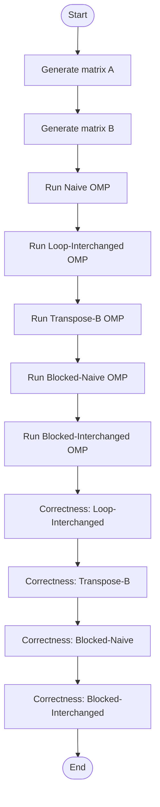

# matmul_multicore.cpp Documentation

This document provides a detailed explanation of the `matmul_multicore.cpp` file, which implements and benchmarks several matrix multiplication algorithms using OpenMP for parallelism. The code compares different methods for performance and correctness on large matrices.

---

## Overview

This file benchmarks parallel matrix multiplication using OpenMP. It includes multiple algorithmic variants:

- **Naive multiplication (OMP)**
- **Loop-interchanged multiplication (OMP)**
- **Transpose-B multiplication (OMP)**
- **Blocked naive multiplication (OMP)**
- **Blocked loop-interchanged multiplication (OMP)**

It measures performance (in seconds and GFLOPS) and checks the correctness of each method.

---

## Compilation

You can compile the code using the following command:

```bash
g++ -O3 -march=native -funroll-loops -std=c++17 -fopenmp matmul_phase2.cpp -o matmul_phase2
```

- `-O3` enables high-level optimizations.
- `-march=native` optimizes for your local CPU.
- `-funroll-loops` improves loop execution speed.
- `-fopenmp` enables OpenMP parallelization.

---

## Key Components

### Libraries Used

| Library         | Purpose                                                                                     |
|-----------------|--------------------------------------------------------------------------------------------|
| `<iostream>`    | Input/output (for printing results, etc.)                                                  |
| `<vector>`      | Dynamic arrays for matrix storage                                                          |
| `<random>`      | Matrix value initialization with random numbers                                            |
| `<chrono>`      | Timing and benchmarking                                                                    |
| `<cmath>`       | Numeric utilities (e.g., `fabs` for floating-point comparison)                             |
| `<omp.h>`       | OpenMP multi-threaded parallelism                                                          |

---

## Matrix Generation

Matrices are stored as 1D vectors for cache efficiency. Initialization uses random values between -5.0 and 5.0.

```cpp
template<typename T>
vector<T> createMatrix(int rows, int cols, unsigned int seed) {
    vector<T> M((size_t)rows * cols);
    mt19937 rng(seed);
    uniform_real_distribution<double> dist(-5.0, 5.0);
    for (auto &x : M) x = static_cast<T>(dist(rng));
    return M;
}
```

- **Usage:** Fast, reproducible matrix creation for benchmarking.
- **Parameters:** Rows, columns, and RNG seed.

---

## Matrix Multiplication Algorithms

### 1. Naive Parallel (OpenMP)

Classic triple loop, parallelized on the outermost loop (`i`). Each thread computes a row of the result.

```cpp
template<typename T>
vector<T> matmul_naive_omp(const vector<T>& A, const vector<T>& B, int m, int n, int p) {
    vector<T> C((size_t)m * p, 0);
    #pragma omp parallel for
    for (int i = 0; i < m; i++)
        for (int j = 0; j < p; j++) {
            T sum = 0;
            for (int k = 0; k < n; k++)
                sum += A[i*n + k] * B[k*p + j];
            C[i*p + j] = sum;
        }
    return C;
}
```

**Parallelism:** Each thread handles a subset of rows.

---

### 2. Loop-Interchanged Parallel (OpenMP)

Reorders loops for better cache access on matrices stored in row-major order, using OpenMP.

```cpp
template<typename T>
vector<T> matmul_interchanged_omp(const vector<T>& A, const vector<T>& B, int m, int n, int p) {
    vector<T> C((size_t)m * p, 0);
    #pragma omp parallel for
    for (int i = 0; i < m; i++) {
        const T* arow = &A[i*n];
        T* crow = &C[i*p];
        for (int k = 0; k < n; k++) {
            T a = arow[k];
            const T* brow = &B[k*p];
            for (int j = 0; j < p; j++)
                crow[j] += a * brow[j];
        }
    }
    return C;
}
```

- **Advantage:** Improves cache locality.

---

### 3. Transpose-B Parallel (OpenMP)

Transposes matrix B for better memory access patterns, then multiplies.

```cpp
template<typename T>
vector<T> transposeB(const vector<T>& B, int n, int p) {
    vector<T> Bt((size_t)p * n);
    #pragma omp parallel for collapse(2)
    for (int k = 0; k < n; k++)
        for (int j = 0; j < p; j++)
            Bt[j*n + k] = B[k*p + j];
    return Bt;
}

template<typename T>
vector<T> matmul_transpose_omp(const vector<T>& A, const vector<T>& B, int m, int n, int p) {
    vector<T> Bt = transposeB(B, n, p);
    vector<T> C((size_t)m * p, 0);
    #pragma omp parallel for
    for (int i = 0; i < m; i++) {
        const T* arow = &A[i*n];
        T* crow = &C[i*p];
        for (int j = 0; j < p; j++) {
            const T* btrow = &Bt[j*n];
            T sum = 0;
            for (int k = 0; k < n; k++)
                sum += arow[k] * btrow[k];
            crow[j] = sum;
        }
    }
    return C;
}
```

- **Benefit:** Improves memory access efficiency.

---

### 4. Blocked Matrix Multiplication (OpenMP)

Divides matrices into small blocks to optimize cache usage. Works in two variants: naive and loop-interchanged.

```cpp
template<typename T>
vector<T> matmul_blocked_omp(const vector<T>& A, const vector<T>& B, int m, int n, int p, int bs, bool use_interchanged) {
    vector<T> C((size_t)m * p, 0);
    #pragma omp parallel for collapse(2)
    for (int ii = 0; ii < m; ii += bs)
    for (int jj = 0; jj < p; jj += bs)
    for (int kk = 0; kk < n; kk += bs) {
        int i_end = min(ii + bs, m);
        int j_end = min(jj + bs, p);
        int k_end = min(kk + bs, n);

        // Blocked-Naive or Blocked-Interchanged (identical in this code)
        for (int i = ii; i < i_end; i++) {
            const T* arow = &A[i*n];
            T* crow = &C[i*p];
            for (int k = kk; k < k_end; k++) {
                T a = arow[k];
                const T* brow = &B[k*p];
                for (int j = jj; j < j_end; j++)
                    crow[j] += a * brow[j];
            }
        }
    }
    return C;
}
```

- **Block Size:** `bs` (e.g., 128)
- **Purpose:** Minimizes cache misses by operating on submatrices.

---

## Correctness Check

Verifies that each optimized method produces the same result as the naive method.

```cpp
template<typename T>
bool almost_equal(const vector<T>& X, const vector<T>& Y) {
    for (size_t i = 0; i < X.size(); i++)
        if (fabs((double)X[i] - (double)Y[i]) > 1e-6)
            return false;
    return true;
}
```

---

## Timing and Performance

Measures execution time and computes GFLOPS (Giga Floating Point Operations per Second):

```cpp
double sec_between(HRClock::time_point a, HRClock::time_point b) {
    return chrono::duration<double>(b - a).count();
}
```

---

## Main Function Flow

The main routine benchmarks all algorithms and checks for result correctness.

```cpp
int main() {
    using Type = double;
    int threads = omp_get_max_threads();
    omp_set_num_threads(threads);
    int m = 1024, n = 1024, p = 1024;
    // Print info, create matrices
    vector<Type> A = createMatrix<Type>(m, n, 1);
    vector<Type> B = createMatrix<Type>(n, p, 2);
    // Lambda for timing/running
    auto run = [&](auto func, string name) { ... };
    // Run all algorithms
    auto C1 = run(matmul_naive_omp<Type>, "Naive (OMP)");
    auto C2 = run(matmul_interchanged_omp<Type>, "Loop-Interchanged (OMP)");
    auto C3 = run(matmul_transpose_omp<Type>, "Transpose-B (OMP)");
    auto C4 = run([&](auto&a,auto&b,int x,int y,int z){ return matmul_blocked_omp(a,b,x,y,z,128,false); }, "Blocked-Naive (OMP)");
    auto C5 = run([&](auto&a,auto&b,int x,int y,int z){ return matmul_blocked_omp(a,b,x,y,z,128,true); }, "Blocked-Interchanged (OMP)");
    // Correctness checks
    cout << "\nCorrectness Check vs Naive:\n";
    cout << "Loop-Interchanged: " << (almost_equal(C1, C2) ? "OK" : "Mismatch!") << endl;
    cout << "Transpose-B: " << (almost_equal(C1, C3) ? "OK" : "Mismatch!") << endl;
    cout << "Blocked-Naive: " << (almost_equal(C1, C4) ? "OK" : "Mismatch!") << endl;
    cout << "Blocked-Interchanged: " << (almost_equal(C1, C5) ? "OK" : "Mismatch!") << endl;
    return 0;
}
```

---

### High-Level Flow Diagram



---

## Output Example

The program prints:

- Matrix dimensions and thread count.
- For each method: execution time and achieved GFLOPS.
- Summary of correctness checks (OK or Mismatch).

---

## Parallelization with OpenMP

OpenMP is used to parallelize outer loops. The code uses:

- `#pragma omp parallel for` for outer loops.
- `#pragma omp parallel for collapse(2)` for nested loops, improving load balancing in blocked algorithms.
- `omp_set_num_threads(threads)` to use all available CPU cores.

---

## Blocked Matrix Multiplication: Why?

Blocked algorithms split matrices into smaller tiles. This:

- Improves cache hits, reducing memory latency.
- Is crucial for large matrices where data does not fit into CPU cache.

---

## Best Practices and Recommendations

```card
{
    "title": "Parallel Matrix Multiplication Tips",
    "content": "Choose blocked algorithms for large matrices and many threads for best performance. Always verify correctness after optimization."
}
```

---

## Summary Table: Algorithms Compared

| Name                | Parallel? | Memory Optimization | Blocking | Comments                         |
|---------------------|-----------|--------------------|----------|----------------------------------|
| Naive OMP           | Yes       | No                 | No       | Simple, easy to understand       |
| Loop-Interchanged   | Yes       | Partial            | No       | Better cache locality            |
| Transpose-B         | Yes       | Good               | No       | Best for row-major, large B      |
| Blocked-Naive       | Yes       | Excellent          | Yes      | Minimizes cache misses           |
| Blocked-Interchanged| Yes       | Excellent          | Yes      | Optimal for large matrices       |

---

## Conclusion

This code provides a comprehensive framework for benchmarking various parallel matrix multiplication strategies using OpenMP. It helps find the best approach for your hardware and matrix sizes. The structure encourages experimentation and learning in high-performance computing.

---

## Further Reading

- [OpenMP Documentation](https://www.openmp.org/)
- [Cache Optimization in Matrix Multiplication](https://en.wikipedia.org/wiki/Matrix_multiplication_algorithm#Optimizing_for_the_cache)
- [Blocked (Tiled) Matrix Multiplication](https://en.wikipedia.org/wiki/Loop_nest_optimization#Blocking)

---